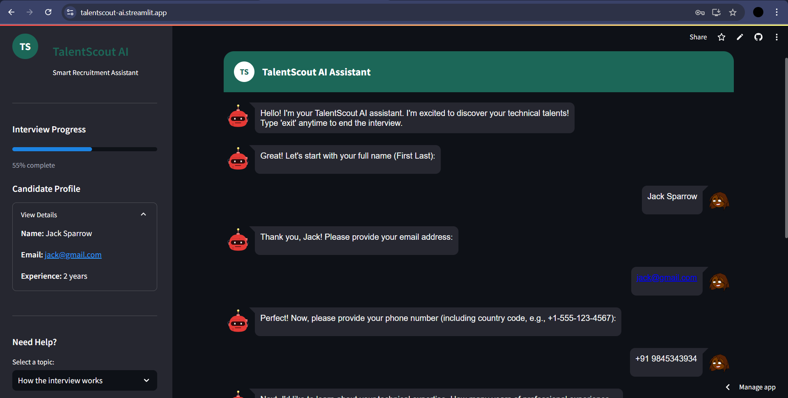
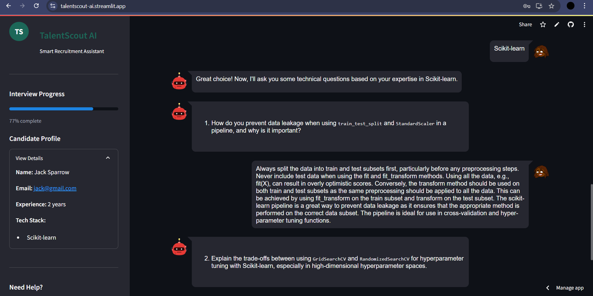

# TalentScout-AI Hiring Assistant Chatbot

## Project Overview
The **Hiring Assistant Chatbot** (TalentScout AI) is an AI-powered virtual interviewer designed to streamline technical hiring processes. This chatbot conducts structured interviews, evaluates candidate responses, and provides a hiring probability score based on their technical proficiency. It integrates AI-powered question generation, authentication, and database management.

## Features
- Interactive AI-driven interview process
- Secure user authentication (Signup/Login)
- Dynamic technical question generation based on roles and skills
- Real-time validation of user inputs (name, email, phone, etc.)
- **MongoDB Atlas for secured cloud storage**
- Gauge chart visualization for hiring probability
- **Deployed on Streamlit Cloud**
- Streamlit-based responsive UI with a professional design

---

## Installation Instructions
### Prerequisites
Ensure you have the following installed:
- Python 3.8+
- MongoDB Atlas (Ensure your connection URI is updated in `data_handler.py`)

### Step 1: Clone the Repository
```sh
git clone https://github.com/Jagdeesh-P/TalentScout-AI-Recruitment-Assistant.git
```

### Step 2: Install Dependencies
```sh
pip install -r requirements.txt
```

### Step 3: Run the Application
```sh
streamlit run app.py
```

---

## Usage Guide
The chatbot follows a structured hiring workflow. Below is the interaction process:

```
+----------------------+        +----------------------+        +----------------------+        +----------------------+
|  User Signup/Login   | ---->  |   Start Interview    | ---->  |  Answer Questions    | ---->  |   Get Evaluation     |
+----------------------+        +----------------------+        +----------------------+        +----------------------+
```

### Step-by-Step Process:
1. **Login/Signup**: Users must first log in or create an account.
2. **Start Interview**: The chatbot greets users and collects their personal and technical details.
3. **Answer Technical Questions**: AI dynamically generates domain-specific questions based on skills and experience.
4. **Get Evaluation**: At the end, the chatbot calculates a hiring probability score and provides feedback.

---

## File Structure & Explanation

### 1. `app.py`
- The main file responsible for rendering the Streamlit UI.
- Handles chat interactions and integrates AI-generated questions.
- Displays the hiring probability gauge chart.

### 2. `login.py`
- Manages user authentication (Signup/Login) using MongoDB Atlas.
- Validates user credentials and securely stores them.

### 3. `data_handler.py`
- Handles database operations with MongoDB Atlas.
- Stores user data, interview responses, and evaluation results securely.

### 4. `validation.py`
- Contains functions for validating user inputs (email, phone, etc.).
- Implements regex-based input sanitization to prevent injection attacks.

---

## Technical Details
### Libraries Used
- **Streamlit**: UI framework
- **Streamlit-Chat**: Chat UI components
- **Google Generative AI (Gemini-2.0-Flash)**: AI-powered interview assistant
- **Plotly**: Data visualization (hiring probability gauge)
- **Pymongo**: MongoDB Atlas database management
- **Python-Dotenv**: Secure API key storage

### Architecture
The system follows a modular architecture:

```
+------------+         +------------+         +------------+         +------------+
|  Frontend  | ---->   |  Backend   | ---->   |   AI API   | ---->   |  Database  |
+------------+         +------------+         +------------+         +------------+
```

- **Frontend**: Streamlit UI for chat interactions
- **Backend**: Python (handling authentication, validation, AI-driven responses)
- **Database**: MongoDB Atlas for secured cloud storage
- **AI Model**: Gemini API for natural language processing

---

## Prompt Design
The chatbot formulates questions dynamically based on job roles and skills.

**Example Prompt for AI Question Generation:**
```text
Generate 5 technical interview questions on {technology} for a {roles} screening with {years} of experience.
The questions should be challenging but answerable in 2-3 lines, focused on practical knowledge and real-world applications.
```

**Example Prompt for Hiring Probability Calculation:**
```text
Evaluate the candidate based on their provided responses.
Complete data is provided
Return only a hiring probability percentage between 0 and 100%.
```

---

## Challenges & Solutions
### Challenge 1: AI-Generated Questions Were Too Generic
**Solution:** Enhanced prompt engineering to generate role-specific and experience-level-adjusted questions.

### Challenge 2: Secure Input Handling
**Solution:** Implemented regex-based validation and input sanitization to prevent injections.

### Challenge 3: Storing Candidate Data Securely
**Solution:** Used MongoDB Atlas instead of local storage, ensuring data integrity and privacy.

### Challenge 4: Maintaining UI Responsiveness
**Solution:** Custom CSS and optimized Streamlit elements for a better user experience.

---

## Deployment Details
- **Live App:** *[TalentScout AI on Streamlit](https://talentscout-ai.streamlit.app/)*
- **Database:** Hosted on **MongoDB Atlas** for secure cloud storage.

---

## Screenshots & Visuals
Below are some UI previews of the application:

1. **Login/Signup Page**  
   

2. **Chatbot Interview Interface**  
   

3. **Chatbot Interview Questions**  
   

4. **Final Evaluation Page**  
   


---

## Future Enhancements
- Expand AI training for improved response evaluation
- Multi-language support for global hiring
- Admin dashboard for HR teams to manage candidates
- Voice-based interaction for better accessibility

---

## Contributors
- **Jagdeesh P** – Project Lead & Developer

For any queries, contact: [jagdeeshpersonal@gmail.com]

---

## License
MIT License

---

*Happy Hiring!* 🚀

